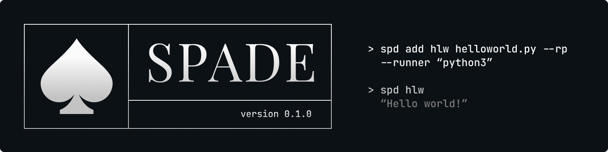

# 

Spade is a lightweight CLI to save, manage, and run reusable command shortcuts with support for templated arguments.

## Installation
```bash
git clone https://github.com/yourusername/spade
cd spade
go build -o spd .
```

## Usage

### Add a script
```bash
spd add <name> <command> [args...]

spd add greet echo "Hello {name}"
spd add copy cp {src} {dst}
spd add hello python3 /path/to/hello.py
```

#### Flags
| Flag | Alias | Description |
|------|-------|-------------|
| `--runner` | | Prepend a runner to the command |
| `--relative-path` | `--rp` | Attach current directory to command path |

### Run a script
```bash
spd <name> [args...]

spd greet Batman                  # positional
spd greet name=Batman             # named
```

#### Flags
| Flag | Alias | Description |
|------|-------|-------------|
| `--dry-run` | `--dr` | Print resolved command without executing |
| `--confirm` | `--c` | Show resolved command and prompt before executing |

### Templates

Placeholders are defined with `{name}` and support inline defaults with `{name=default}`.
```bash
spd add hwx echo "Hello {name=world} : {id}"

spd hwx                        # uses default: Hello world : <missing>
spd hwx spade                  # positional:   Hello spade : <missing>
spd hwx spade 42               # positional:   Hello spade : 42
spd hwx name=spade id=42       # named:        Hello spade : 42
spd hwx spade id=42            # mixed:        Hello spade : 42
```
> **Note:** If a placeholder with a default value appears before one without,
> the non-default placeholder must be passed by name. Positional args fill
> placeholders in order, so a default won't be skipped automatically.
```bash
spd add greet echo "Hello {name=world} {id}"

spd greet 42           # wrong:  Hello 42 : <missing id>
spd greet id=42        # correct: Hello world : 42
```

### Argument forwarding
```bash
# flags before -- are parsed by spade
spd sit --version
# spade version 0.1.0

# flags after -- are forwarded to the script
spd sit -- --version
# sit 0.1.0
```

### List scripts
```bash
spd list
```

### Show script details
```bash
spd info <name>
```

### Update a script
```bash
spd update <name> [--command <cmd>] [--args <args>]

spd update hwx --command "echo"
spd update hwx --args "Hello {name=world} : {id}"
spd update hwx --command "echo" --args "Hello {name=world} : {id}"
```

#### Flags
| Flag | Alias | Description |
|------|-------|-------------|
| `--command` | `-c` | New command to run |
| `--args` | `-a` | New args |

### Rename a script
```bash
spd rename <old-name> <new-name>
spd rnm <old-name> <new-name>
```

### Remove a script
```bash
spd remove <name>
spd rm <name>
```

## Commands

| Command | Aliases | Description |
|---------|---------|-------------|
| `add` | `a` | Add a new script |
| `list` | `ls` | List all saved scripts |
| `info` | `i` | Show details of a script |
| `update` | `u` | Update an existing script |
| `rename` | `rnm` | Rename a script |
| `remove` | `rm` | Remove a script |

## Data

Scripts are stored in `~/.config/spade/spade.db` (SQLite).